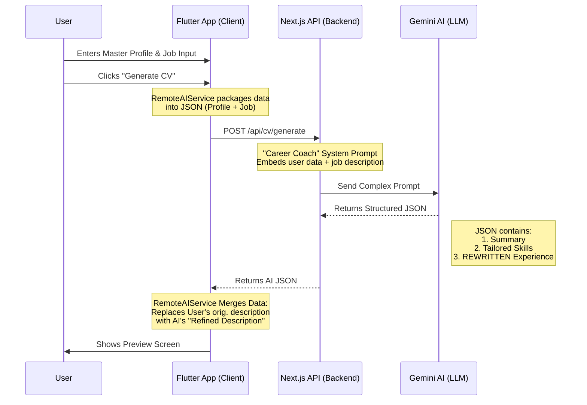

# 📘 Developer Guide

## 🏗 System Architecture (Clean Architecture + Serverless)

This project uses a hybrid **Flutter (Client)** + **Next.js (Backend)** architecture to deliver AI features securely and cheaply.

## 🛠 Directory Structure
*   `lib/presentation/`: UI & Widgets (Feature-first).
*   `lib/data/`: Data Layer.
    *   `repositories/`: Logic that decides *where* to get data (Mock vs Remote).
    *   `datasources/`: Actual API calls (`RemoteAIService.dart`).
*   `backend/`: Next.js Serverless Project.
    *   `app/api/`: API Routes.
    *   `types/`: Shared TypeScript interfaces.

## 🚀 Key Data Follow
1.  **Input**: User fills `UserDataFormPage`. Data is stored in `CVCreationProvider`.
2.  **Trigger**: `CVDisplayNotifier.build()` calls `CVRepository.generateCV()`.
3.  **API Call**: `RemoteAIService` hits `http://localhost:3000/api/cv/generate`.
4.  **AI Logic**: Checks `backend/app/api/cv/generate/route.ts`. 
5.  **Refinement**: The backend returns specific rewritten descriptions (`analyzedExperience`).
6.  **Merging**: Flutter maps these new descriptions back into the `experience` list before showing it to the user.

---

## 🎨 How-To: Adding New CV Templates
... (Rest of the file)
