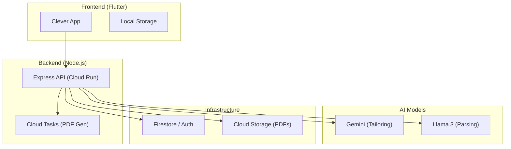
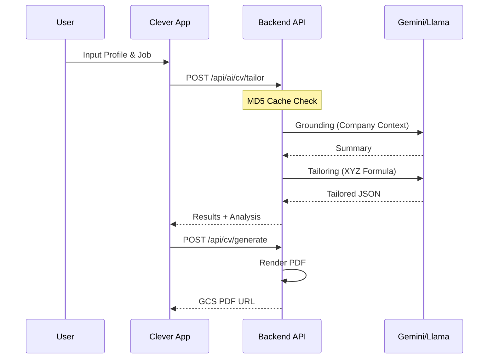

<p align="center">
  
</p>

# Clever

> **The Smart CV Builder — AI-Powered Career Excellence**

Clever is a premium, AI-driven resume builder designed to help job seekers create professional, ATS-optimized resumes in minutes. Built with Flutter, it offers a seamless cross-platform experience with deep AI integration for tailoring content to specific job descriptions.

[](https://flutter.dev)
[](https://firebase.google.com)
[](LICENSE)

**English 🇺🇸** | [Bahasa Indonesia 🇮🇩](README_ID.md) | [🌐 Website](https://cleverpwebsite.vercel.app/)

---

## 📺 Demo Video

[](https://www.youtube.com/watch?v=RzeYjZ_eVbs)

---

## ⚠️ Portfolio Disclaimer

**Important Notice for Developers & Recruiters:**

This repository serves as a **Personal Portfolio Showcase**. While the frontend code is public to demonstrate architectural patterns, UI/UX design, and Flutter expertise, the project is **not fully open-source** in a turnkey sense:

1.  **Private Backend**: Many features (AI Tailoring, Job Extraction, PDF Rendering) depend on a proprietary backend API hosted on Google Cloud Run.
2.  **Private Credentials**: The `.env` file and Firebase configuration containing production keys are not included in this repository.
3.  **No Mocks (Yet)**: There is currently no local mock implementation to bypass the backend requirement. A "Playground Mode" with mocks is planned for future updates.

---

## Features

- **Advanced AI Tailoring**: Automatically optimize every section of your CV for specific job postings using Gemini-powered logic.
- **AI Job Extraction**: Extract requirements and key skills directly from job URLs or raw text descriptions.
- **13+ Premium Templates**: A diverse library of ATS-friendly, Modern, Creative, and Professional layouts.
- **Master Profile**: Manage your career data in one place—Experience, Education, Projects, and Skills.
- **Real-time Analytics**: Track your CV generation stats and career progress via the integrated dashboard.
- **Concurrent Pre-generation**: Smart performance optimization that triggers backend rendering while users engage with the app.
- **Premium Wallet**: Integrated subscription and credit system powered by RevenueCat.
- **Interactive Onboarding**: Guided walkthroughs to ensure users make the most of every feature.

---

## Architecture

Clever uses a dual-AI strategy and a cloud-native infrastructure to deliver high-performance tailoring.

### System Components



### Data Pipeline Flow



---

## Quick Start

### Prerequisites

- Flutter SDK `^3.10.1`
- Dart `^3.0.0`
- Android Studio / Xcode

### Installation

1.  **Clone the repository**
    ```bash
    git clone https://github.com/Amrlmlna/CleVer.git
    cd clever
    ```

2.  **Install dependencies**
    ```bash
    flutter pub get
    ```

3.  **Note on Execution**
    Running the app locally will result in functional boundaries unless you provide your own Firebase configuration and a compatible Backend API endpoint in a `.env` file.

---

## Project Structure

```
lib/
├── core/
│   ├── constants/         # Design tokens, local data (regions, universities)
│   ├── router/           # GoRouter configuration
│   ├── services/         # External integrations (Payment, Analytics, AI)
│   └── theme/            # App branding & design system
├── domain/
│   ├── entities/         # Pure business logic objects
│   └── repositories/     # Abstract data contracts
├── data/
│   ├── models/           # DTOs and JSON serialization
│   ├── repositories/     # Repository implementations
│   └── datasources/      # Remote & Local data clients
└── presentation/
    ├── auth/             # User authentication flow
    ├── cv/               # CV editing & step-by-step creation
    ├── dashboard/        # Career insights & user metrics
    ├── home/             # Main landing & quick actions
    ├── jobs/             # Job extraction & analysis
    ├── notification/     # FCM handling & notification center
    ├── onboarding/       # Interactive feature walkthrough
    ├── profile/          # Master career profile management
    ├── templates/        # Premium template gallery
    └── wallet/           # Credits & subscription management
```

---

## Development

### Code Analysis
```bash
flutter analyze
```

### Build Generation
The project uses `riverpod_generator` and `json_serializable`. To generate code:
```bash
flutter pub run build_runner build --delete-conflicting-outputs
```

---

## Templates

| Category | Best For | Templates Available |
|----------|----------|---------------------|
| **ATS-Friendly** | Corporate & Large Firms | 5 Layouts |
| **Modern** | Startups & Tech | 4 Layouts |
| **Creative** | Design & Media | 2 Layouts |
| **Executive** | Leadership Roles | 2 Layouts |

---

## Roadmap

- [ ] **Mock Playground**: Local mock data to allow running the app without the private backend.
- [ ] **Cover Letter AI**: Fully automated, tailored cover letter generation.
- [ ] **LinkedIn Integration**: One-click profile import.
- [ ] **Web Version**: Responsive web dashboard for CV management.

---

## Support

- Issues: [GitHub Issues](https://github.com/Amrlmlna/CleVer/issues)
- Developer: [Amrlmlna](https://github.com/Amrlmlna)

---

## License

This project is licensed under the MIT License - see the [LICENSE](LICENSE) file for details.
