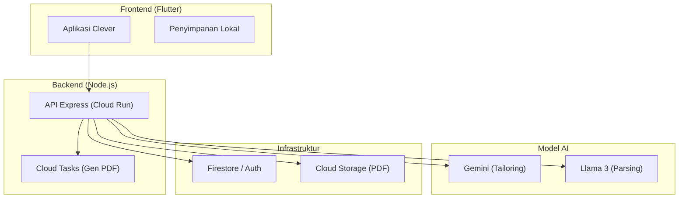
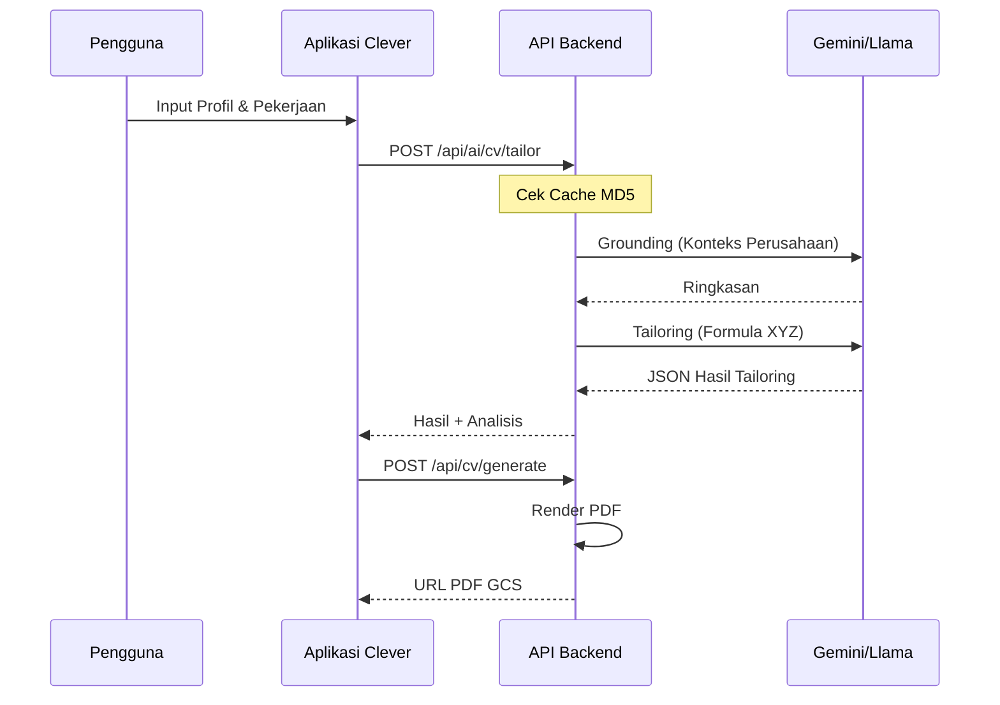

<p align="center">
  
</p>

# Clever

> **Pembuat CV Cerdas — Keunggulan Karir Berbasis AI**

Clever adalah pembuat resume premium berbasis AI yang dirancang untuk membantu pencari kerja membuat resume profesional yang teroptimasi ATS dalam hitungan menit. Dibangun dengan Flutter, aplikasi ini menawarkan pengalaman lintas platform yang mulus dengan integrasi AI mendalam untuk menyesuaikan konten dengan deskripsi pekerjaan tertentu.

[](https://flutter.dev)
[](https://firebase.google.com)
[](LICENSE)

[English 🇺🇸](README.md) | **Bahasa Indonesia 🇮🇩** | [🌐 Website](https://cleverpwebsite.vercel.app/)

---

## 📺 Video Demo

[](https://www.youtube.com/watch?v=RzeYjZ_eVbs)

---

## ⚠️ Sanggahan Portofolio

**Pemberitahuan Penting untuk Developer & Rekruiter:**

Repositori ini berfungsi sebagai **Showcase Portofolio Pribadi**. Meskipun kode frontend bersifat publik untuk mendemonstrasikan pola arsitektur, desain UI/UX, dan keahlian Flutter, proyek ini **tidak sepenuhnya open-source** yang siap pakai secara langsung:

1.  **Backend Privat**: Banyak fitur (AI Tailoring, Ekstraksi Pekerjaan, Rendering PDF) bergantung pada API backend kepemilikan yang di-host di Google Cloud Run.
2.  **Kredensial Privat**: File `.env` dan konfigurasi Firebase yang berisi kunci produksi tidak disertakan dalam repositori ini.
3.  **Tidak Ada Mock (Saat Ini)**: Saat ini tidak ada implementasi mock lokal untuk melewati persyaratan backend. Mode "Playground" dengan mock direncanakan untuk pembaruan mendatang.

---

## Fitur

- **AI Tailoring Lanjutan**: Secara otomatis mengoptimalkan setiap bagian CV Anda untuk lowongan kerja tertentu menggunakan logika berbasis Gemini.
- **Ekstraksi Pekerjaan AI**: Ekstrak persyaratan dan keterampilan utama langsung dari URL pekerjaan atau deskripsi teks mentah.
- **13+ Templat Premium**: Koleksi beragam tata letak yang ramah ATS, Modern, Kreatif, dan Profesional.
- **Profil Utama (Master Profile)**: Kelola data karir Anda di satu tempat—Pengalaman, Pendidikan, Proyek, dan Keterampilan.
- **Analitik Real-time**: Pantau statistik pembuatan CV dan kemajuan karir Anda melalui dashboard terintegrasi.
- **Pre-generasi Konkuren**: Optimasi performa cerdas yang memicu rendering backend saat pengguna berinteraksi dengan aplikasi.
- **Wallet Premium**: Sistem langganan dan kredit terintegrasi yang didukung oleh RevenueCat.
- **Onboarding Interaktif**: Panduan langkah-demi-langkah untuk memastikan pengguna memanfaatkan setiap fitur secara maksimal.

---

## Arsitektur

Clever menggunakan strategi dual-AI dan infrastruktur cloud-native untuk memberikan penyesuaian (tailoring) berperforma tinggi.

### Komponen Sistem



### Alur Pipeline Data



---

## Memulai Cepat

### Prasyarat

- Flutter SDK `^3.10.1`
- Dart `^3.0.0`
- Android Studio / Xcode

### Instalasi

1.  **Clone repositori**
    ```bash
    git clone https://github.com/Amrlmlna/CleVer.git
    cd clever
    ```

2.  **Instal dependensi**
    ```bash
    flutter pub get
    ```

3.  **Catatan tentang Eksekusi**
    Menjalankan aplikasi secara lokal akan memiliki batasan fungsional kecuali Anda menyediakan konfigurasi Firebase Anda sendiri dan endpoint API Backend yang kompatibel di file `.env`.

---

## Struktur Proyek

```
lib/
├── core/
│   ├── constants/         # Token desain, data lokal (wilayah, universitas)
│   ├── router/           # Konfigurasi GoRouter
│   ├── services/         # Integrasi eksternal (Pembayaran, Analitik, AI)
│   └── theme/            # Branding & sistem desain aplikasi
├── domain/
│   ├── entities/         # Objek logika bisnis murni
│   └── repositories/     # Kontrak data abstrak
├── data/
│   ├── models/           # DTO dan serialisasi JSON
│   ├── repositories/     # Implementasi repositori
│   └── datasources/      # Client data Remote & Lokal
└── presentation/
    ├── auth/             # Alur autentikasi pengguna
    ├── cv/               # Pengeditan CV & pembuatan langkah-demi-langkah
    ├── dashboard/        # Insight karir & metrik pengguna
    ├── home/             # Beranda utama & aksi cepat
    ├── jobs/             # Ekstraksi & analisis pekerjaan
    ├── notification/     # Penanganan FCM & pusat notifikasi
    ├── onboarding/       # Walkthrough fitur interaktif
    ├── profile/          # Manajemen profil karir utama
    ├── templates/        # Galeri templat premium
    └── wallet/           # Manajemen kredit & langganan
```

---

## Pengembangan

### Analisis Kode
```bash
flutter analyze
```

### Pembuatan Kode (Build Generation)
Proyek ini menggunakan `riverpod_generator` dan `json_serializable`. Untuk menghasilkan kode:
```bash
flutter pub run build_runner build --delete-conflicting-outputs
```

---

## Templat

| Kategori | Cocok Untuk | Templat Tersedia |
|----------|-------------|------------------|
| **Ramah ATS** | Perusahaan Korporat & Besar | 5 Tata Letak |
| **Modern** | Startup & Teknologi | 4 Tata Letak |
| **Kreatif** | Desain & Media | 2 Tata Letak |
| **Eksekutif** | Peran Kepemimpinan | 2 Tata Letak |

---

## Rencana Ke Depan (Roadmap)

- [ ] **Mock Playground**: Data mock lokal untuk memungkinkan menjalankan aplikasi tanpa backend privat.
- [ ] **AI Surat Lamaran**: Pembuatan surat lamaran otomatis yang disesuaikan sepenuhnya.
- [ ] **Integrasi LinkedIn**: Impor profil satu klik.
- [ ] **Versi Web**: Dashboard web responsif untuk manajemen CV.

---

## Dukungan

- Masalah: [GitHub Issues](https://github.com/Amrlmlna/CleVer/issues)
- Developer: [Amrlmlna](https://github.com/Amrlmlna)

---

## Lisensi

Proyek ini dilisensikan di bawah Lisensi MIT - lihat file [LICENSE](LICENSE) untuk detailnya.
